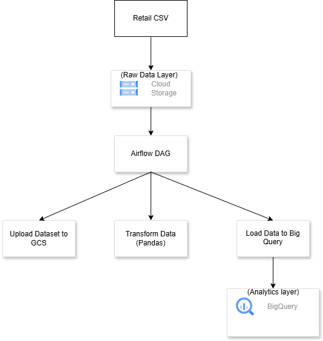
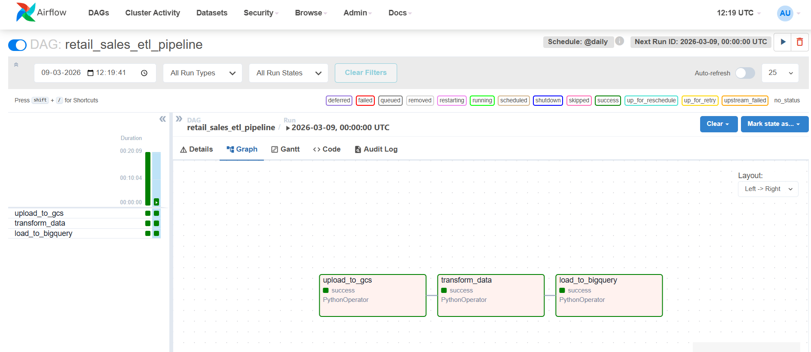

# Retail Sales ETL Pipeline using Apache Airflow, GCP, and Docker

## Project Overview

This project implements an **end-to-end ETL pipeline** using **Apache Airflow** orchestrated inside **Docker**. The pipeline processes retail sales data stored in **Google Cloud Storage (GCS)** and loads transformed data into **BigQuery** for analytics.

## Architecture

Airflow DAG orchestrates the following steps:

1. Upload raw CSV data to Google Cloud Storage
2. Download raw data from GCS
3. Perform data transformation using Pandas
4. Upload processed data back to GCS
5. Load processed data into BigQuery

## Architecture



## Tech Stack

* Apache Airflow
* Docker & Docker Compose
* Google Cloud Storage
* Google BigQuery
* Python (Pandas)
* GCP Service Accounts


## Project Structure

```
gcp-airflow-retail-etl/
│
├── dags/
│   └── retail_sales_etl_dag.py
│
├── scripts/
│   ├── upload_to_gcs.py
│   ├── transform_data.py
│   └── load_to_bigquery.py
│
├── data/
│   └── retail_sales.csv
│
├── docker-compose.yaml
└── README.md
```

## DAG Workflow

upload_to_gcs → transform_data → load_to_bigquery

## Airflow Pipeline



## How to Run

1. Clone the repository
2. Configure GCP credentials
3. Start Airflow:

```
docker compose up -d
```

4. Open Airflow UI

```
http://localhost:8080
```

5. Trigger the DAG **retail_sales_etl_pipeline**

## Outcome

The pipeline successfully processes retail sales data and loads the transformed dataset into **BigQuery** for analytics and reporting.

---

This project demonstrates practical experience with **data engineering workflows, cloud storage, orchestration, and containerized environments.**
